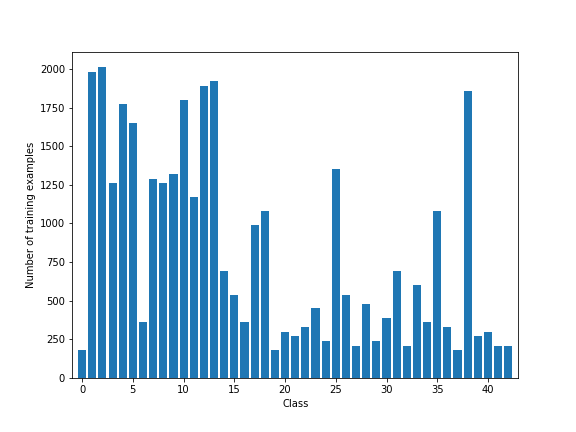
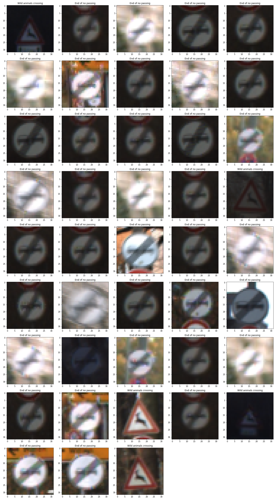
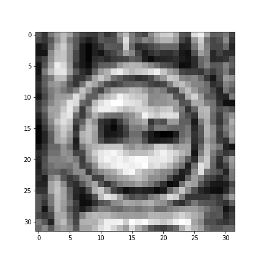

## Project: Build a Traffic Sign Recognition Program

### Dataset Exploration
#### Dataset Summary
 - Traffic sign image size: 32x32x3
 - Number of classes: 43
 
|              | Training | Validation |  Test    |
| ------------ |:--------:|:----------:|:--------:|
| dataset size |   34799  |     4410   |   12630  |

#### Image Processing and Augmentation
- Convert RGB image to gray scale: Y = 0.299 R + 0.587 G + 0.114 B
- Apply local contrast enhancement using `skimage.exposure.equalize_adapthist`
- Normalize the image by image / 255

