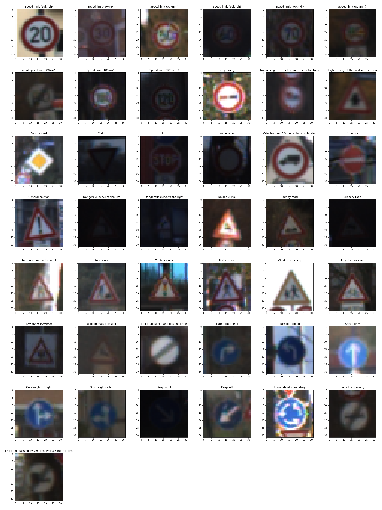

## Project: Build a Traffic Sign Recognition Program
[](http://www.udacity.com/drive)

### Dataset Exploration
#### Dataset Summary
 - Traffic sign image size: 32x32x3
 - Number of classes: 43
 
|              | Training | Validation |  Test    |
| ------------ |:--------:|:----------:|:--------:|
| dataset size |   34799  |     4410   |   12630  |

Distribution of classes indicates that the training sample is not balanced, classes like 'End of No Passing', 'Dangerous curve to the left' etc. are very few, which are less than 250. I also show images of traffic sign for each classes, and find that the contrast and exposure of some images are very low. 




#### Image Processing and Augmentation
In order to improve contrast, I pre-process the image using the following steps

- Convert RGB image to gray scale: Y = 0.299 R + 0.587 G + 0.114 B
- Apply local contrast enhancement using `skimage.exposure.equalize_adapthist`
- Normalize the image by image / 255

ImageDataGenerator of keras is used to generate batches of augmented tensor image in training. The images are 

 - randomly rotated with +/- 20deg range
 - randomly shifted in the x and y direction with +/- 6 pixels (20% of the image size)
 - randomly zoomed with a factor ranging from 0.8 to 1.2
 - randomly sheared within +/- 0.5 rad


#### Model Architecture

I use 4 convoluted layers with 64, 128, 256 and 512 filters respectively, and each of which is followed by a maximum pooling with keep probability of 0.7. I do not use any regularization in the begining, it is very easy to overfit the model during traning, the accuracy of traning is very easy to reach 99% but the accuracy of validation is still around 80% - 90%. Then I add drop out for each layer to avoid overfitting.

|              | input size  | kernel size | filters | keep probability |
| ------------ |:-----------:|:-----------:|:-------:|:----------------:|
|    conv2D    | 32 x 32 x 1 |    5 x 5    |    64   |      0.7         |
|    conv2D    | 5 x 5 x 64  |    3 x 3    |   128   |      0.7         |
|    conv2D    | 3 x 3 x 128 |    3 x 3    |   256   |      0.7         |
|    conv2D    | 3 x 3 x 256 |    3 x 3    |   512   |      0.7         |
|  full connect | flatten    |             |         |      0.7         |
|  full connect | 256        |             |         |      0.7         |
|  full connect | 128        |             |         |      0.5         |
|  full connect | 43         |             |         |                  |

#### Model Training
The prediction is transformed into a probability distribution using softmax `softmax_i = exp(y_i) / sum (exp_i) `
. The cross entropy between the predicted probability distribution (y’) and the actual vector score probability distribution (y) is `cross entropy = - sum (y'_i * log(softmax_i))`. I minimize the cross entropy using AdamOptimizer with the following parameters, L2 regularization is addded which improve the accuracy by 0.5%.

``` 
batch size = 512
learning rate = 0.0005
epoch = 100
earlying stopping patience = 30
L2 lambda = 0.0001 
```
The following plots show the loss function and accurracy of training set and valuation set. 

```
Valid loss: 0.02809283, accuracy = 0.99%
Test loss: 0.09074351, accuracy = 0.98%
```

#### Test a Model on New Images
