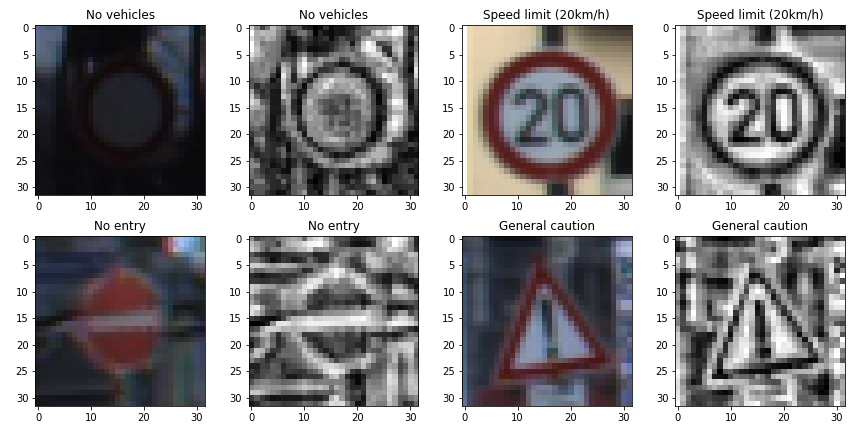

## Project: Build a Traffic Sign Recognition Program

### Dataset Exploration
#### Dataset Summary
 - Traffic sign image size: 32x32x3
 - Number of classes: 43
 
|              | Training | Validation |  Test    |
| ------------ |:--------:|:----------:|:--------:|
| dataset size |   34799  |     4410   |   12630  |

The distribution of class labels indicates that the training sample is not balanced,

labels like 'End of No Passing', 'Dangerous curve to the left' etc. are less than 250.

The following plot shows 43 traffic signs, the contract and exposure of some images are very low.

#### Image Processing and Augmentation
- Convert RGB image to gray scale: Y = 0.299 R + 0.587 G + 0.114 B
- Apply local contrast enhancement using `skimage.exposure.equalize_adapthist`
- Normalize the image by image / 255

ImageDataGenerator of keras is used to generate batches of augmented tensor image in training. The images are 

 - randomly rotated with +/- 20deg range
 - randomly shifted in the x and y direction with +/- 6 pixels (20% of the image size)
 - randomly zoomed with a factor ranging from 0.8 to 1.2
 - randomly sheared within +/- 0.5 rad

#### Model Architecture

|              | input size  | kernel size | filters | keep probability |
| ------------ |:-----------:|:-----------:|:-------:|:----------------:|
|    conv2D    | 32 x 32 x 1 |    5 x 5    |    64   |      0.7         |
|    conv2D    | 5 x 5 x 64  |    3 x 3    |   128   |      0.7         |
|    conv2D    | 3 x 3 x 128 |    3 x 3    |   256   |      0.7         |
|    conv2D    | 3 x 3 x 256 |    3 x 3    |   512   |      0.7         |
|  full connect | flatten    |             |         |      0.7         |
|  full connect | 256        |             |         |       0.7        |
|  full connect | 128        |             |         |       0.5        |
|  full connect | 43         |             |         |                  |

